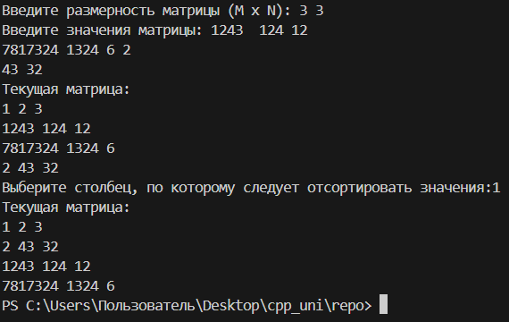
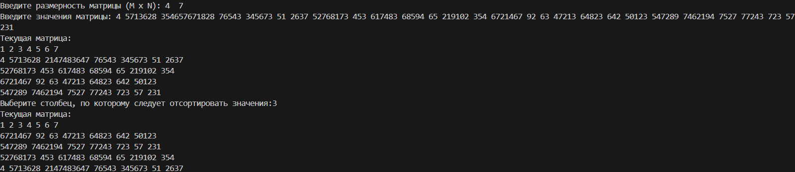
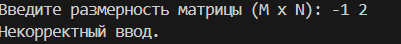
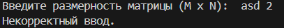
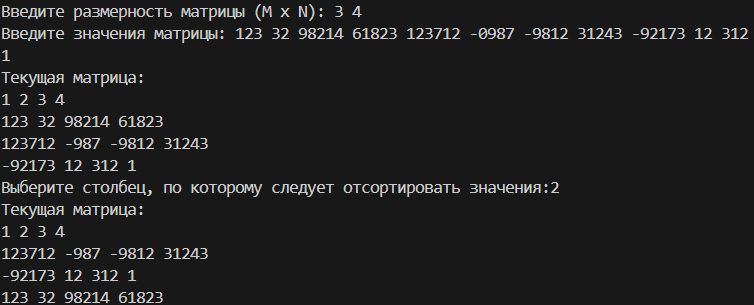
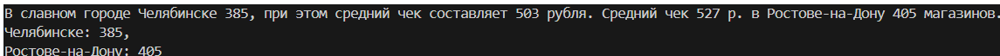

# Вариант 12

***Задача 1.***
Дан двумерный массив. В первой строке массива указаны номера столбцов.
Вводится значение K – номер столбца матрицы. Упорядочить элементы
матрицы в соответствии с порядком в K столбце.

  
   
  
  
  

***Задача 2.***
В необработанном тексте имеется информация о количестве магазинов
«Пятёрочка» в каждом городе. В тексте имеются и числовые данные,
связанные со средним чеком покупателей в этих магазинах. Нужно написать
программу, которая выведет на экран сколько магазинов в указанных городах.
Склонение города не менять. Регулярные выражения не использовать.
Ввод: В славном городе Челябинске 385, при этом средний чек составляет 503
рубля. Средний чек 527 р. в Ростове-на-Дону 405 магазинов.

